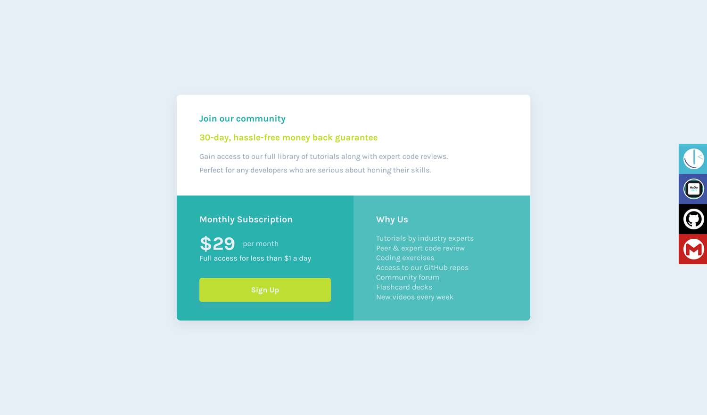

# Frontend Mentor - Single price grid component solution

This is a solution to the [Single price grid component challenge on Frontend Mentor](https://www.frontendmentor.io/challenges/single-price-grid-component-5ce41129d0ff452fec5abbbc). Frontend Mentor challenges help you improve your coding skills by building realistic projects. 

## Table of contents

- [Overview](#overview)
  - [The challenge](#the-challenge)
  - [Screenshot](#screenshot)
  - [Links](#links)
- [My process](#my-process)
  - [Built with](#built-with)
- [Author](#author)
- [Acknowledgments](#acknowledgments)

## Overview

### The challenge

Users should be able to:

- View the optimal layout for the component depending on their device's screen size
- See a hover state on desktop for the Sign Up call-to-action

### Screenshot

#### Desktop

#### Mobile

### Links

- Solution URL: [Github repository solution URL here](https://github.com/hadodev/SinglePriceGridComponent)
- Live Site URL: [Live site URL here](https://hadodev-fem-articlepreviewcomponent.netlify.app)

## My process

### Built with

- Semantic HTML5 markup
- CSS custom properties
- Flexbox
- CSS Grid
- Mobile-first workflow
- [Astro](https://astro.build/) - The web framework for content-driven websites

## Author

- GitHub - [Hado Dev](https://github.com/hadodev)
- Frontend Mentor - [@hadodev](https://www.frontendmentor.io/profile/hadodev)

## Acknowledgments

For all authors who publish open source ressources and contents freely available and make Internet more awesome.